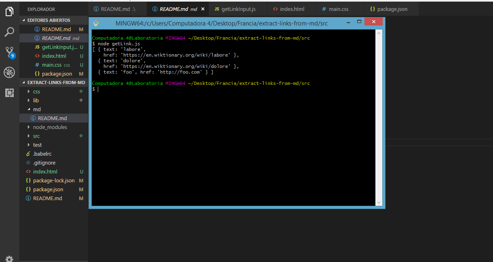
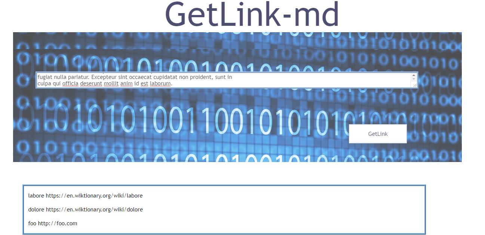

# extractLinksFromMd

* **Track:** _Common Core_
* **Curso:** _JS Deep Dive: Crea tu propia librería usando JavaScript_
* **Unidad:** _Producto final_
* **Equipo:** _Alex y Francia_

***

Implementar un módulo de Node.js que reciba un string (en formato Markdown) y
extraiga todos los links encontrados. La implementación debe ser una función que
recibe un string y devuelve un arreglo de objetos como se muestra en el este
ejemplo:

```js
const extractLinksFromMd = require('extract-links-from-md');
const str = `# Lorem ipsum

Lorem ipsum dolor sit amet, consectetur adipiscing elit, sed do eiusmod tempor
incididunt ut [labore](https://en.wiktionary.org/wiki/labore) et
[dolore](https://en.wiktionary.org/wiki/dolore) magna aliqua. Ut enim ad minim
veniam, quis nostrud exercitation ullamco laboris nisi ut aliquip ex ea commodo
consequat.

[foo](http://foo.com)

Duis aute irure dolor in reprehenderit in voluptate velit esse cillum dolore eu
fugiat nulla pariatur. Excepteur sint occaecat cupidatat non proident, sunt in
culpa qui officia deserunt mollit anim id est laborum.`;

const links = extractLinksFromMd(str);

console.log(links);
// [
//   { href: 'https://en.wiktionary.org/wiki/labore', text: 'labore' },
//   { href: 'https://en.wiktionary.org/wiki/dolore', text: 'dolore' },
//   { href: 'http://foo.com', text: 'foo' },
// ]
```
## Uso de Usuario 

# Get Link

**Get Link** extrae links de textos en formato markdown como módulo en Node.js y desde el browser.

## Instalación

Inicia npm con el siguiente comando en tu terminal:

   npm init


Instala, en el directorio raiz de tu proyecto, el siguiente comando en tu terminal:

   npm install get-the-link-markdown

## Uso

### Node

Entra en la carpeta **lib** y guarda, con nombre **README.md**, el archivo del que requieras extraer los links.


En la consola ejecuta el comando **node getLink.js** y objendras los links que contiene el archivo en un array de objetos.



### Browser

Incluye en tu HTML el siguiente 'script'

[<[script src="./lib/getLinkInput.js"></script]>]

#### Ingresa el texto en el recuedro y da click en GetLink


#### En la parte inferior tendras como resultado un array con objetos




## Autoras

Francia Vázquez & Alejandra Durán
